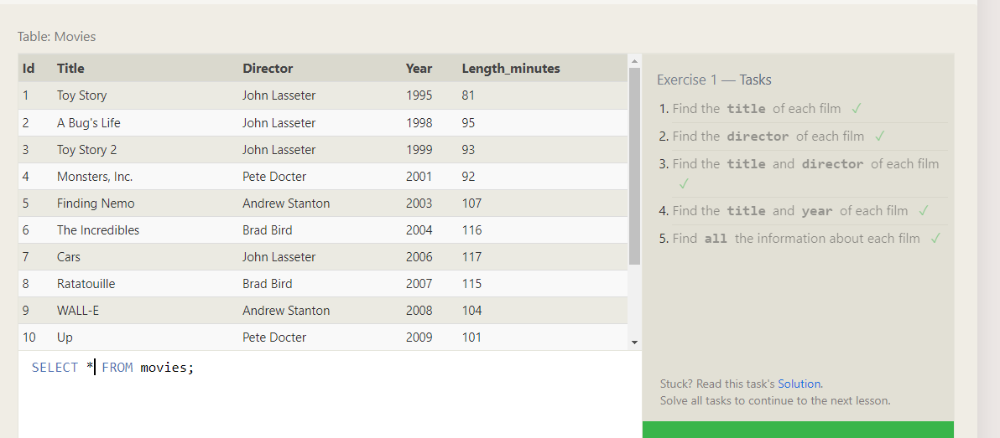

<h5>&&Relational databases and SQL</h5>
######Relational Database:the database relation debend table related with each other 
###### SQL is the standard language for dealing with Relational Databases

#####2-Practice running common SQL commands using the following SQL Bolt tutorials.
Lessons 1
Lessons 2
Lessons 3
Lessons 4
Lessons 5
Lessons 6
Lessons 7
Lessons 8
Lessons 9
Lessons 10
Lessons 11
Lessons 12
Lessons 13
 Lessons 14
Lessons 15
Lessons 16
Lessons 17
Lessons 18

