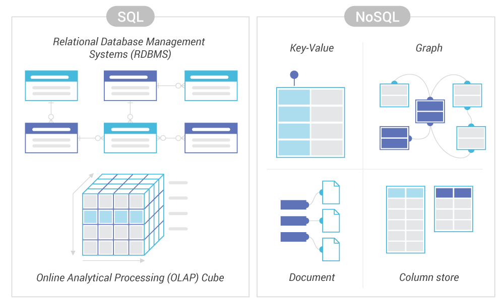

<h2 align="center">SQL vs NoSQL</h2>

#### At a high level, SQL and NoSQL comply with separate rules for resolving transactions. RDBMSs must exhibit four “ACID” properties:

- Atomicity means all transactions must succeed or fail completely. They cannot be partially-complete, even in the case of system failure.
- Consistency means that at each step the database follows invariants: rules which validate and prevent corruption.
- Isolation prevents concurrent transactions from affecting each other. Transactions must result in the same final state as if they were run sequentially, even if they were run in parallel.
- Durability makes transactions final. Even system failure cannot roll-back the effects of a successful transaction.

#### NoSQL technologies adhere to the “CAP” theorem, which says that in any distributed database, only two of the following properties can be guaranteed at once:

- Consistency: Every request receives the most recent result, or an error. (Note this is different than in ACID)
- Availability: Every request has a non-error result, regardless of how recent that result is.
- Partition tolerance: Any delays or losses between nodes will not interrupt the system’s operation.

### When to use SQL vs NoSQL for your business.
Generally, NoSQL is preferred for:

- Graph or hierarchical data
- Data sets which are both large and mutate significantly,
- Businesses growing extremely fast but lacking data schemata.
- In terms of use cases, this might translate to social networks, online content management, streaming analytics, or mobile applications.

### SQL is more appropriate when the data is:

- Small
- Conceptually modeled as tabular
- In systems where consistency is critical.

