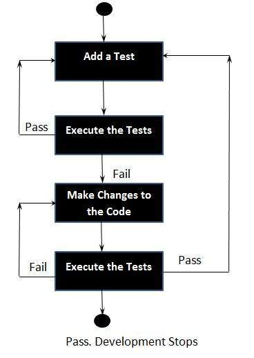

## What is NPM?

A package in Node.js contains all the files you need for a module.

Modules are JavaScript libraries you can include in your project.

 ##### npm consists of three distinct components:

- the website
- the Command Line Interface (CLI)
- the registry

 ##### website 
 to discover packages, set up profiles, and manage other aspects of your npm experience. For example, you can set up organizations to manage access to public or private packages.

##### CLI 
runs from a terminal, and is how most developers interact with npm.

#### registry
 is a large public database of JavaScript software and the meta-information surrounding it.

#### What is Test-Driven Development (TDD)?
Test-driven development starts with developing test for each one of the features. The test might fail as the tests are developed even before the development. Development team then develops and refactors the code to pass the test.

Test-driven development is related to the test-first programming evolved as part of extreme programming concepts.

###### Test-Driven Development Process:
- Add a Test

- Run all tests and see if the new one fails

- Write some code

- Run tests and Refactor code

- Repeat

#### EXAMPLE

## CI/CD
Your CI/CD interview questions will, at the minimum, cover some basic concepts such as what is CI and how it works.

#### What Is Continuous Integration?
Continuous integration (CI) is a software development methodology where developers — following the trunk-based model — merge their changes to the main branch many times per day.

CI is supported by automated tests and a build server that runs them on every change. As a result, failures are made visible as soon as they are introduced and can be fixed within minutes.

#### How Do CI and Version Control Relate to One Another?
Every change in the code must trigger a continuous integration process. This means that a CI system must be connected with a Git repository to detect when changes are pushed, so tests can be run on the latest revision.

####  What’s the Difference Between Continuous Integration, Continuous Delivery, and Continuous Deployment?
Continuous integration (CI) executes the sequence of steps required to build and test the project. CI runs automatically on every change committed to a shared repository, offering developers quick feedback about the project’s state.

